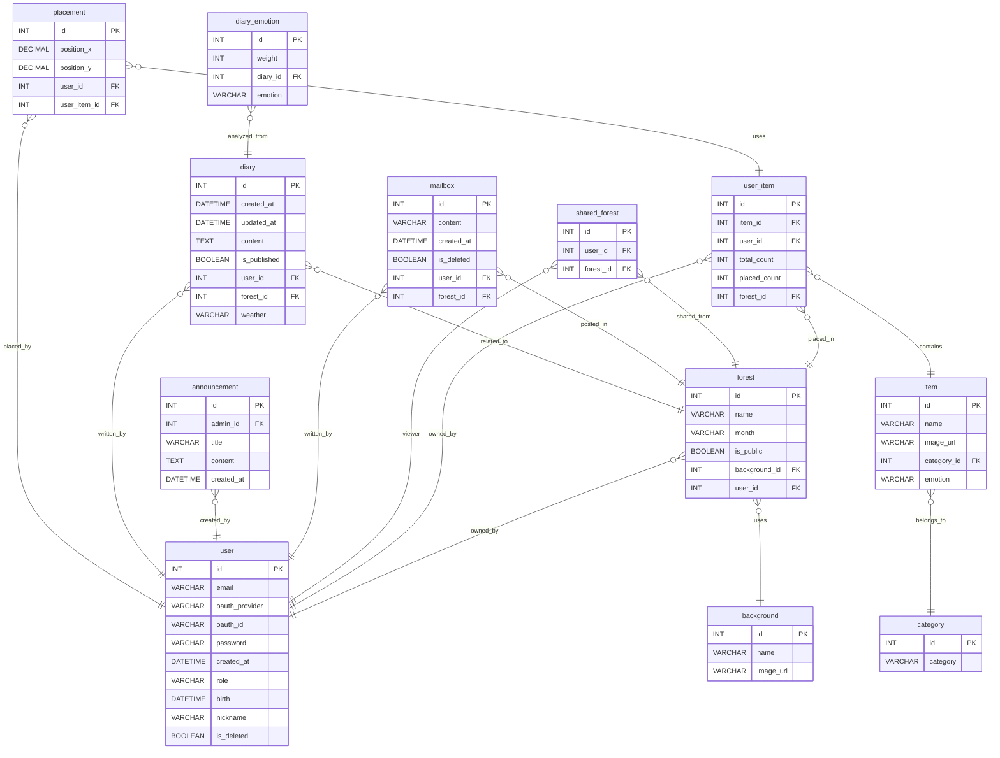

# 🌳 Groo 

### __"감정을 기록하고, 정원으로 표현하는 감성 다이어리 서비스"__


<details>
  <summary>다른 화면 구경하기</summary>

  

  

  

  

  


</details>


<br><br><br>

# 🚀 Team X1 🚀

|  |  |  |  |  |  |
| :-----------------------------------------------------------------------------------------------------: | :-----------------------------------------------------------------------------------------------------: | :-----------------------------------------------------------------------------------------------------: | :-----------------------------------------------------------------------------------------------------: | :-----------------------------------------------------------------------------------------------------: | :------------------------------------------------------------------------------------------------------: |
| 황수민 | 신민경 | 이예원 | 조윤태 | 이준규 | 박지원 |
| [](https://github.com/emily9949) | [](https://github.com/mmmv41) | [](https://github.com/oni128) | [](https://github.com/cxzaqq) | [](https://github.com/JK-LEE98) | [](https://github.com/zi-won) |


<br><br>
# 🌱 기획 의도

우리는 하루에도 여러 감정을 겪지만, 그 감정들이 지나간 자리에는 종종 아무것도 남지 않습니다.
Groo는 바로 이 순간들을 놓치지 않고, 감정을 기록하고 표현할 수 있는 특별한 공간을 만들고자 시작되었습니다.

단순한 텍스트 일기장을 넘어, Groo는 감정을 시각적으로 표현합니다.
사용자가 일기를 작성하면, AI가 감정을 분석하고 그 결과에 따라 정원을 꾸밀 수 있는 자연 요소(꽃, 나무, 날씨 등)를 제공합니다.
이렇게 표현된 감정은 ‘하루치 마음’을 담은 작은 정원이 되고,
시간이 지날수록 하나의 개인적인 감정의 숲으로 확장되어 갑니다.

Groo는 위로를 주기 위한 도구라기보다는, 스스로의 감정과 마음 상태를 바라보고 표현하는 일상의 루틴이 되기를 지향합니다.
감정은 좋고 나쁨의 문제가 아니라, 존재 자체로 의미가 있다는 믿음 아래
슬픔, 기쁨, 불안, 설렘 등 다양한 감정을 있는 그대로 기록하고 남길 수 있도록 도와줍니다.

또한 사용자는 혼자만의 정원을 가꿀 수도 있고, 친구들과 함께 숲을 만들어 서로의 감정을 공유할 수도 있습니다.
이처럼 Groo는 “감정의 표현”과 “정서적 연결”, 두 가지를 중심으로 사용자에게 새로운 경험을 제공합니다.

단 한 줄의 일기라도 괜찮아요.
그날의 감정이 하나의 나무가 되어, 당신의 정원에 자랍니다. 🌱

<br><br> 

# 📦 CICD

### 아키텍처

<details>
  <summary>아키텍처 보기</summary>

  

</details>

### jenkins 파이프라인 코드

<details>
  <summary>코드 보기</summary>
  
  ```groovy
pipeline {
    agent any

    tools {
        gradle 'gradle'
        jdk 'openJDK17'
    }

    environment {
        GITHUB_URL = 'https://github.com/x1-company/be14-4th-x1-GROO-BE.git'
    }

    stages {
        stage('Preparation') {
            steps {
                script {
                    if (isUnix()) {
                        sh 'docker --version'
                    } else {
                        bat 'docker --version'
                    }
                }
            }
        }

        stage('Checkout & Inject Secrets') {
            steps {
                git branch: 'feature/roy/CICD', url: "${env.GITHUB_URL}"
                withCredentials([file(credentialsId: 'x1_groo_boot-yml', variable: 'APP_YML_PATH')]) {
                    script {
                        if (isUnix()) {
                            sh "mkdir -p ./src/main/resources"
                            sh "cp $APP_YML_PATH ./src/main/resources/application.yml"
                        } else {
                            bat 'if not exist src\\main\\resources mkdir src\\main\\resources'
                            bat 'copy %APP_YML_PATH% src\\main\\resources\\application.yml'
                        }
                    }
                }
            }
        }

        stage('Source Build') {
            steps {
                script {
                    if (isUnix()) {
                        sh "chmod +x ./gradlew"
                        sh "./gradlew clean build"
                    } else {
                        bat "gradlew.bat clean build"
                    }
                }
            }
        }

        stage('Container Build and Push') {
            steps {
                script {
                    withCredentials([usernamePassword(credentialsId: 'DOCKERHUB_PASSWORD', usernameVariable: 'DOCKER_USER', passwordVariable: 'DOCKER_PASS')]) {
                        if (isUnix()) {
                            sh "docker login -u ${DOCKER_USER} -p ${DOCKER_PASS}"
                            sh "docker build -t ${DOCKER_USER}/x1_groo_boot:latest ."
                            sh "docker push ${DOCKER_USER}/x1_groo_boot:latest"
                        } else {
                            bat "docker login -u %DOCKER_USER% -p %DOCKER_PASS%"
                            bat "docker build -t ${DOCKER_USER}/x1_groo_boot:latest ."
                            bat "docker push ${DOCKER_USER}/x1_groo_boot:latest"
                        }
                    }
                }
            }
        }

        stage('Run Container') {
            steps {
                script {
                    def containerName = "x1_groo_boot_container"
                    def imageName = "cxzaqq/x1_groo_boot:latest"

                    if (isUnix()) {
                        sh "docker ps -q --filter 'name=${containerName}' | grep -q . && docker rm -f ${containerName} || echo 'No existing container to remove'"
                        sh "docker run -d --name ${containerName} -p 8080:8080 ${imageName}"
                    } else {
                        bat """
                            FOR /F %%i IN ('docker ps -q --filter "name=${containerName}"') DO docker rm -f %%i
                            docker run -d --name ${containerName} -p 8080:8080 ${imageName}
                            docker ps
                            docker logs ${containerName}
                        """
                    }
                }
            }
        }
    }

    post {
        always {
            script {
                // application.yml 삭제
                if (isUnix()) {
                    sh 'rm -f ./src/main/resources/application.yml'
                    sh 'docker logout'
                } else {
                    bat 'del /F /Q src\\main\\resources\\application.yml'
                    bat 'docker logout'
                }
            }
        }
        success {
            echo 'Pipeline succeeded!'
        }
        failure {
            echo 'Pipeline failed!'
        }
    }
}
```
</details>

### 테스트 결과

<details>
  <summary>링크 보기</summary>

  https://ohgiraffers.notion.site/CICD-1e8649136c1180f78da6f0e62d73bb0b?pvs=73

</details>

<br><br>

# 📚 문서

### ERD
<details>
    <summary>ERD Cloud</summary>

</details>
<details>
    <summary>ERD 상세보기</summary>
  

</details>

### 요구사항 명세서

<details>
  <summary>요구사항 명세서 보기</summary>
  


</details>

### 테스트 케이스

<details>
  <summary>테스트 케이스 보기</summary>
  


</details>

<br><g4>

# 🛠️ 기술 스택

### FRONTEND  


### BACKEND  


### DB  


### DESIGN  


### TOOL  


<br><br>

# 개인 회고

<details>
  <summary>회고 보기</summary>

  |이름|회고|
  |------|---|
  |박지원|내용|
  |신민경|내용|
  |이예원|내용|
  |이준규|이번 프로젝트는 발표 형식이 아닌, 부스를 통해 서로의 서비스를 직접 체험해보는 형식이었기 때문에 주제 선정부터 쉽지 않았습니다. 특히 사용자의 직접적인 참여가 중요한 형태였기에, 기획 단계에서부터 프론트엔드 요소에 많은 신경을 썼습니다. 하지만 백엔드 개발자를 희망하는 우리 팀이 과연 이런 방향이 맞는가에 대한 고민도 함께 들었습니다. 모델링을 마치고 본격적으로 백엔드 개발에 착수했을 때, 예상보다 훨씬 복잡하고 어렵다는 걸 느꼈습니다. 단순히 테이블 수는 적었지만, 고려해야 할 로직이 많아 기능 구현 이후에도 반복적인 수정 작업이 필요했습니다. 저는 주로 조회 기능을 맡아 개발했고, 그 과정에서 MyBatis와 SQL에 대한 이해가 한층 깊어졌다는 점에서 의미 있는 시간이었습니다. 이번 프로젝트에서는 이전과 달리 백엔드와 프론트엔드를 실제로 연동해 개발을 진행했습니다. 이전 프로젝트에서는 각 서버를 분리해 작업했기 때문에, 기능만 정상 동작하면 된다고 생각했었습니다. 하지만 이번엔 프론트엔드에서 어떤 데이터가 필요하고 어떻게 처리되는지를 고려하며 백엔드를 개발해야 한다는 점을 체감했고, 이 경험이 큰 깨달음이 되었습니다. 또한, 이번 프로젝트에서는 S3 서버와 Redis 서버도 활용해보았습니다. 이전까지는 이름조차 낯설었던 기술들이었지만, 직접 적용해보며 백엔드 개발자로서 한층 성장할 수 있었던 뜻깊은 경험이었습니다. 프론트엔드 개발에서는 메인 화면을 윤태와 함께 나눠 담당했습니다. 백엔드에서 전달된 weather 값을 기반으로 총 7개의 날씨 컴포넌트를 동적으로 호출하는 로직을 구현했는데, 서비스에서 차지하는 비중이 큰 기능이기도 하고 UI의 완성도에 따라 전체 서비스의 인상이 달라지는 만큼 더 열심히 몰입했습니다. 날씨가 정상적으로 화면에 표시되었을 때 느낀 성취감은 이번 프로젝트 전체를 통틀어 가장 컸던 순간이었습니다. 일기 작성 시에는 OpenAI API를 활용해 감정 분석 기능을 구현했습니다. 백엔드와 프론트엔드 개발 경험만 있던 저에게는 매우 신선한 도전이었습니다. Fine-tuning까지 직접 해볼 수 있었다면 더욱 정확한 분석 모델을 만들 수 있었겠지만, 관련 지식 부족으로 포기하게 된 점은 아쉬움으로 남습니다. 기회가 된다면, AI 전문가와 함께 융합 프로젝트를 진행해보고 싶다는 생각도 하게 되었습니다. 마지막으로, 이 프로젝트를 함께한 팀원들에게 깊은 감사를 전하고 싶습니다. 짧은 시간, 높은 강도에도 불구하고 서로를 배려하며 끝까지 함께해준 팀원들이 없었다면 절대 2등이라는 값진 결과를 얻지 못했을 것입니다. AI를 도맡아주고 감각적인 디자인 작업에 더해 백엔드 리뷰까지 꼼꼼히 진행해준 수민이, 일기 기능을 완성도 높게 구현하고 OpenAI API 연동을 도맡아준 지원이, 완벽한 Figma 디자인과 함께 팀 분위기를 이끌며 로그인과 우정의 숲이라는 핵심 기능을 묵묵히 맡아준 민경이, 최적의 AI API를 찾기 위해 수많은 테스트를 거쳐 직접 적용해보고, git 충돌이 많을 수밖에 없던 상황에서 항상 마지막 차례에 병합을 하여 힘들었을 텐데 묵묵히 병합과 재개발을 반복해준 예원이, 기획부터 개발, 배포까지 모든 과정을 총괄하며 팀의 버팀목 역할을 해주고 팀원들의 수많은 질문을 받아주며 본인 개발 뿐만 아니라 모든 도메인 모든 기능에 신경 써준 윤태에게 진심으로 고맙다는 말을 전하며 이번 프로젝트 회고를 마칩니다.|
  |조윤태|이번 프로젝트는 혼자였다면 결코 해낼 수 없었을 만큼, 팀의 힘이 얼마나 큰지를 온전히 느낄 수 있었던 소중한 경험이었습니다.<br>주제 자체도 흥미로워 즐겁게 몰입할 수 있었고, 팀원들 모두 각자 맡은 역할을 자발적으로 찾아서 능동적으로 움직여준 덕분에 좋은 결과를 얻을 수 있었습니다.<br>혼자 코딩을 공부하던 시절과 비교하면, 함께 협업하며 문제를 해결하고 의견을 주고받는 과정이 훨씬 더 즐겁고 몰입감 있게 느껴졌습니다. 특히 부족한 시간 속에서 밤낮 없이 작업하던 피곤하고 예민한 상황 속에서도, 서로를 배려하고 웃음을 잃지 않으며 끝까지 팀워크를 지켜나간 점이 매우 인상 깊었습니다.<br>한 번은 너무 지쳐서 마음이 꺾일 뻔한 순간도 있었지만, 그럴 때마다 “할 수 있다”고 격려해주고 묵묵히 자기 할 일을 해나가는 팀원들의 모습에 힘을 얻어, 저 역시 다시 마음을 다잡고 집중할 수 있었습니다.<br>무엇보다 이번 프로젝트는 단순한 과제를 넘어서, 실현 가능한 서비스에 가까운 결과물이 나왔다는 점에서 큰 의미가 있다고 생각합니다. 따라서 여기서 멈추지 않고, 앞으로도 기능을 계속 추가하고 고도화하여 실제 서비스로 배포하는 것을 목표로 삼았습니다.<br>정말 값지고 뜻깊은 시간이었으며, 이 모든 것을 함께해준 팀원들에게 진심으로 감사의 마음을 전합니다.<br>최종 프로젝트에서도 잘 부탁드리고, 팀원들 모두 건강하길 바라며 마칩니다.|
  |황수민|내용|

</details>
