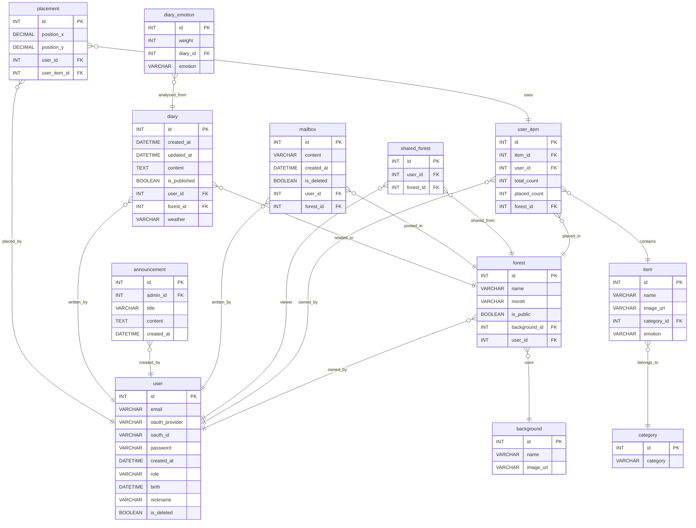

# 🌳 Groo 

## "감정을 기록하고, 정원으로 표현하는 감성 다이어리 서비스"

<br><br><br>

# 🚀 Team X1 🚀

|  |  |  |  |  |  |
| :-----------------------------------------------------------------------------------------------------: | :-----------------------------------------------------------------------------------------------------: | :-----------------------------------------------------------------------------------------------------: | :-----------------------------------------------------------------------------------------------------: | :-----------------------------------------------------------------------------------------------------: | :------------------------------------------------------------------------------------------------------: |
| 황수민 | 신민경 | 이예원 | 조윤태 | 이준규 | 박지원 |
| [](https://github.com/emily9949) | [](https://github.com/mmmv41) | [](https://github.com/oni128) | [](https://github.com/cxzaqq) | [](https://github.com/JK-LEE98) | [](https://github.com/zi-won) |

<br><br>
# 🌱 기획 의도

우리는 하루에도 여러 감정을 겪지만, 그 감정들이 지나간 자리에는 종종 아무것도 남지 않습니다.
Groo는 바로 이 순간들을 놓치지 않고, 감정을 기록하고 표현할 수 있는 특별한 공간을 만들고자 시작되었습니다.

단순한 텍스트 일기장을 넘어, Groo는 감정을 시각적으로 표현합니다.
사용자가 일기를 작성하면, AI가 감정을 분석하고 그 결과에 따라 정원을 꾸밀 수 있는 자연 요소(꽃, 나무, 날씨 등)를 제공합니다.
이렇게 표현된 감정은 ‘하루치 마음’을 담은 작은 정원이 되고,
시간이 지날수록 하나의 개인적인 감정의 숲으로 확장되어 갑니다.

Groo는 위로를 주기 위한 도구라기보다는, 스스로의 감정과 마음 상태를 바라보고 표현하는 일상의 루틴이 되기를 지향합니다.
감정은 좋고 나쁨의 문제가 아니라, 존재 자체로 의미가 있다는 믿음 아래
슬픔, 기쁨, 불안, 설렘 등 다양한 감정을 있는 그대로 기록하고 남길 수 있도록 도와줍니다.

또한 사용자는 혼자만의 정원을 가꿀 수도 있고, 친구들과 함께 숲을 만들어 서로의 감정을 공유할 수도 있습니다.
이처럼 Groo는 “감정의 표현”과 “정서적 연결”, 두 가지를 중심으로 사용자에게 새로운 경험을 제공합니다.

단 한 줄의 일기라도 괜찮아요.
그날의 감정이 하나의 나무가 되어, 당신의 정원에 자랍니다. 🌱
# CICD

## 아키텍처

<details>
  <summary>아키텍처 보기</summary>

  

</details>

## jenkins 파이프라인 코드

<details>
  <summary>코드 보기</summary>
  
  ```groovy
pipeline {
    agent any

    tools {
        gradle 'gradle'
        jdk 'openJDK17'
    }

    environment {
        GITHUB_URL = 'https://github.com/x1-company/be14-4th-x1-GROO-BE.git'
    }

    stages {
        stage('Preparation') {
            steps {
                script {
                    if (isUnix()) {
                        sh 'docker --version'
                    } else {
                        bat 'docker --version'
                    }
                }
            }
        }

        stage('Checkout & Inject Secrets') {
            steps {
                git branch: 'feature/roy/CICD', url: "${env.GITHUB_URL}"
                withCredentials([file(credentialsId: 'x1_groo_boot-yml', variable: 'APP_YML_PATH')]) {
                    script {
                        if (isUnix()) {
                            sh "mkdir -p ./src/main/resources"
                            sh "cp $APP_YML_PATH ./src/main/resources/application.yml"
                        } else {
                            bat 'if not exist src\\main\\resources mkdir src\\main\\resources'
                            bat 'copy %APP_YML_PATH% src\\main\\resources\\application.yml'
                        }
                    }
                }
            }
        }

        stage('Source Build') {
            steps {
                script {
                    if (isUnix()) {
                        sh "chmod +x ./gradlew"
                        sh "./gradlew clean build"
                    } else {
                        bat "gradlew.bat clean build"
                    }
                }
            }
        }

        stage('Container Build and Push') {
            steps {
                script {
                    withCredentials([usernamePassword(credentialsId: 'DOCKERHUB_PASSWORD', usernameVariable: 'DOCKER_USER', passwordVariable: 'DOCKER_PASS')]) {
                        if (isUnix()) {
                            sh "docker login -u ${DOCKER_USER} -p ${DOCKER_PASS}"
                            sh "docker build -t ${DOCKER_USER}/x1_groo_boot:latest ."
                            sh "docker push ${DOCKER_USER}/x1_groo_boot:latest"
                        } else {
                            bat "docker login -u %DOCKER_USER% -p %DOCKER_PASS%"
                            bat "docker build -t ${DOCKER_USER}/x1_groo_boot:latest ."
                            bat "docker push ${DOCKER_USER}/x1_groo_boot:latest"
                        }
                    }
                }
            }
        }

        stage('Run Container') {
            steps {
                script {
                    def containerName = "x1_groo_boot_container"
                    def imageName = "cxzaqq/x1_groo_boot:latest"

                    if (isUnix()) {
                        sh "docker ps -q --filter 'name=${containerName}' | grep -q . && docker rm -f ${containerName} || echo 'No existing container to remove'"
                        sh "docker run -d --name ${containerName} -p 8080:8080 ${imageName}"
                    } else {
                        bat """
                            FOR /F %%i IN ('docker ps -q --filter "name=${containerName}"') DO docker rm -f %%i
                            docker run -d --name ${containerName} -p 8080:8080 ${imageName}
                            docker ps
                            docker logs ${containerName}
                        """
                    }
                }
            }
        }
    }

    post {
        always {
            script {
                // application.yml 삭제
                if (isUnix()) {
                    sh 'rm -f ./src/main/resources/application.yml'
                    sh 'docker logout'
                } else {
                    bat 'del /F /Q src\\main\\resources\\application.yml'
                    bat 'docker logout'
                }
            }
        }
        success {
            echo 'Pipeline succeeded!'
        }
        failure {
            echo 'Pipeline failed!'
        }
    }
}
```
</details>

## 테스트 결과

<details>
  <summary>링크 보기</summary>

  https://ohgiraffers.notion.site/CICD-1e8649136c1180f78da6f0e62d73bb0b?pvs=73

</details>

## ERD
<details>
    <summary>ERD Cloud</summary>

</details>
<details>
    <summary>ERD 상세보기</summary>
  

</details>

# 개인 회고

<details>
  <summary>회고 보기</summary>

  |이름|회고|
  |------|---|
  |박지원|내용|
  |신민경|내용|
  |이예원|내용|
  |이준규|내용|
  |조윤태|내용|
  |황수민|내용|

</details>
